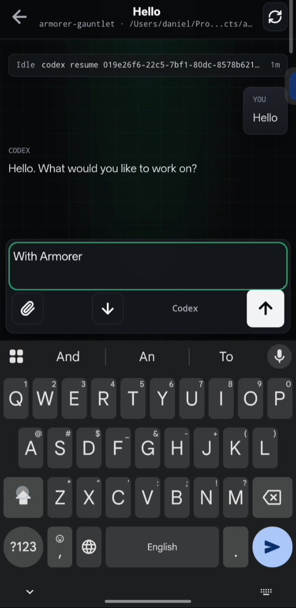

# Armorer Gauntlet
### Put your coding agents in your pocket

Armorer Gauntlet is a mobile command deck for coding agents running on your own machine. Pair your phone, watch running work, send the next instruction, approve supported requests, get notified when an agent needs you, then jump back to the laptop when it is time to go deep.

Local-first by default. Self-hosted relay. End-to-end encrypted app messages. No laptop credentials on the phone.


[Self-hosting](docs/self-host.md) · [Protocol](docs/protocol.md) · [Development](docs/development.md) · [Security](SECURITY.md) · [License](LICENSE)

---

## Demo

<p align="center">
  <a href="docs/assets/armorer-gauntlet-demo.mp4">
    
  </a>
</p>

<p align="center">
  <a href="docs/assets/armorer-gauntlet-demo.mp4">Watch the 27-second demo</a>
</p>

## One Command

```bash
make setup && make start
```

Scan the QR printed in the terminal. Your phone opens Gauntlet, pairs with the local daemon, and becomes the pocket control surface for your local agent runtime.

Keep `make start` running while you use the app. Stop it with `Ctrl+C`.

## Use Your Agent

Point Codex, Claude Code, or another coding agent at this repo and ask:

```text
Set up Armorer Gauntlet from this repository on this machine.
Follow AGENTS.md, README.md, and docs/self-host.md.
Verify Node.js 20+, npm, Docker or Colima, and the currently supported local agent CLI.
Run make setup, then make start.
Do not delete .env, Docker volumes, ~/.armorer-gauntlet, local agent auth, or existing user files without explicit confirmation.
Do not report success until the relay, PWA, HTTPS tunnel, and local daemon are running and the terminal prints a phone QR.
```

## Humans

Prefer the manual path?

Requirements:

- macOS with [Colima](https://github.com/abiosoft/colima), Docker Desktop, OrbStack, or another Docker engine.
- Node.js 20+ and npm.
- Latest supported agent CLI, logged in locally. Today that means `codex-cli 0.121.0+`; newer models can require newer Codex builds.

Run:

```bash
make setup
make start
```

What happens:

- `make setup` installs npm dependencies, builds internal workspace libraries, checks Docker, and generates local push keys in `.env`.
- `make start` refreshes internal workspace libraries, brings up the relay, PWA, HTTPS tunnel, and local daemon.
- The daemon prints a short-lived QR. Scan it with your phone camera.

Daily-driver commands:

```bash
make logs     # follow relay/PWA/tunnel logs
make down     # stop local containers
make check    # typecheck, test, and build
```

## Why Gauntlet

| Raw remote control | Armorer Gauntlet |
| --- | --- |
| Terminal UI on a phone | Purpose-built mobile PWA |
| Missed approvals | Approval cards stay surfaced near the composer |
| Lost session context | Sessions, status, history, and handoff commands in one view |
| Relay sees too much | Relay routes encrypted frames and generic push only |
| Mobile sleep breaks the flow | Reconnects and re-registers push on wake |

## What You Get

- QR-first phone pairing with short-lived one-time tokens.
- Session inbox for local agent threads.
- New session creation from local daemon workspaces.
- Mobile chat with optimistic message reconciliation.
- Markdown-rendered agent responses.
- Supported approval responses from mobile.
- Generic Web Push for approvals, input requests, failures, and ready-for-instructions transitions.
- Mobile and desktop browser e2e coverage with mocked daemon/relay fixtures.

## The Shape

```text
Phone PWA  <--E2EE WebSocket-->  Self-hosted relay  <--E2EE WebSocket-->  Dev machine daemon  -->  provider adapter
```

- `apps/relay`: WebSocket relay. Routes encrypted frames, stores bounded encrypted offline queues, sends generic Web Push.
- `apps/daemon`: local bridge. Starts/connects to the supported provider adapter, reuses local agent auth, prints the QR, bridges provider events.
- `apps/pwa`: mobile-first SvelteKit PWA. Pairs from the QR, lists and creates sessions, sends messages, handles approvals, registers push.
- `packages/shared`: protocol types, validation, and E2EE helpers.
- `packages/codex-protocol`: generated TypeScript bindings from `codex app-server generate-ts --experimental`.

The daemon runs outside Docker because it needs your local agent login and local sessions. New sessions start on the daemon with a selected local `cwd`, so the phone can only target paths that exist on your dev machine.

## Security Model

The QR link contains a short-lived one-time pairing token plus the daemon public key. If someone scans the newest QR before you do, they can pair, but that token cannot be reused after it is claimed.

After pairing, app traffic is encrypted end to end between the phone and daemon. The relay cannot decrypt session content.

The PWA settings screen shows the paired daemon and paired phone count. Use **Reset pairing on this phone** to remove the phone key locally, or **Revoke paired phones on daemon** to clear daemon pairings and require a fresh QR.

## Notifications

`make setup` generates VAPID keys in `.env` and exposes the public key to the PWA build. After pairing, open Settings, tap `Enable push`, then `Send test`. Notification text stays generic because the relay cannot decrypt session content.

If the public tunnel URL changes, run `make start` again and scan the new QR. The phone can reconnect to a temporarily dropped relay socket, but it cannot discover a brand-new tunnel hostname from an old pairing.

## Provider Compatibility

Codex is the first supported coding-agent provider, not the product boundary. The daemon/provider split is designed so future adapters can map their own sessions, messages, status, approvals, and attention events into the same mobile protocol.

For the current Codex adapter, the daemon requires `codex-cli 0.121.0+` and uses `codex app-server` as the integration surface. If a session says a model requires a newer version of Codex, upgrade the local laptop Codex CLI and restart `make start`; it is not a phone or relay issue.

Regenerate Codex protocol bindings after upgrading Codex:

```bash
npm run generate:codex-protocol
```

## Advanced Commands

```bash
make up       # run relay + PWA + local front door without starting the daemon
make daemon   # start the local daemon against RELAY_URL
make tunnel   # print the HTTPS tunnel URL and relay URL
make logs     # follow relay/PWA/tunnel logs
make down     # stop local containers
make check    # typecheck, test, and build
```

Override the daemon relay URL:

```bash
make daemon RELAY_URL=wss://gauntlet.example.com/relay
```

## Verification

```bash
npm run check
npm test
npm run build
npm run test:e2e
```

`npm run check` also verifies that internal workspace exports are built and importable, which catches fresh-clone package mistakes before they reach users. `npm run test:e2e` uses a mocked relay/daemon fixture and covers mobile and desktop browser flows with Playwright.

## Release Notes

- `.env` contains generated VAPID private keys and is intentionally ignored.
- The daemon stores local identity and paired phone keys under `~/.armorer-gauntlet/daemon.json`.
- The relay must be served over HTTPS/WSS for camera scanning, service workers, and push notifications on real phones.
- Armorer Gauntlet is released under the Apache License 2.0. Workspace packages remain marked private because this repository is not publishing npm packages yet.

## Docs

- [docs/self-host.md](docs/self-host.md): advanced deploy notes, daemon state, and troubleshooting.
- [docs/protocol.md](docs/protocol.md): relay frames, pairing, E2EE, and app messages.
- [docs/development.md](docs/development.md): repo layout, scripts, development workflow, and provider notes.
- [docs/agent-deploy-prompt.md](docs/agent-deploy-prompt.md): prompt for an LLM/operator agent deploying this repo.
